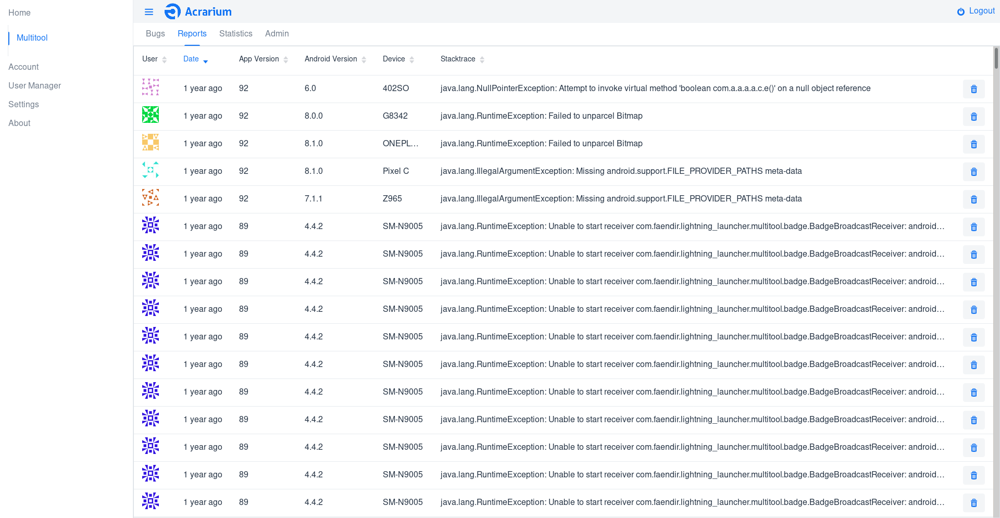
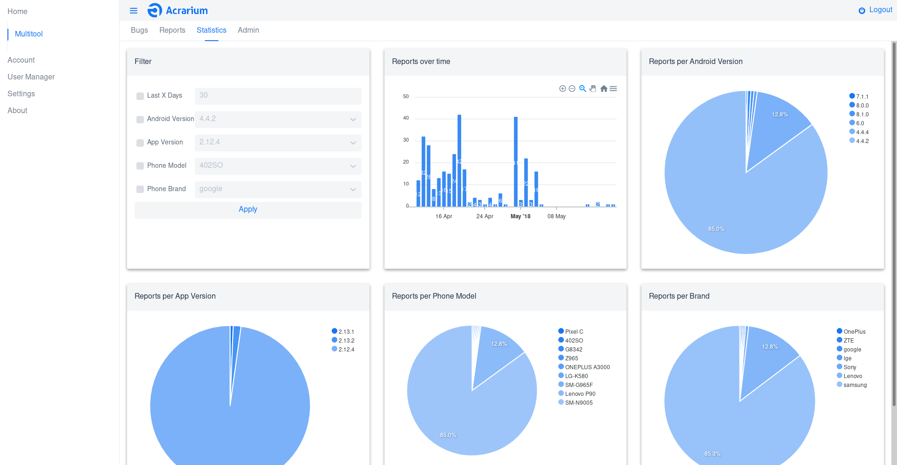
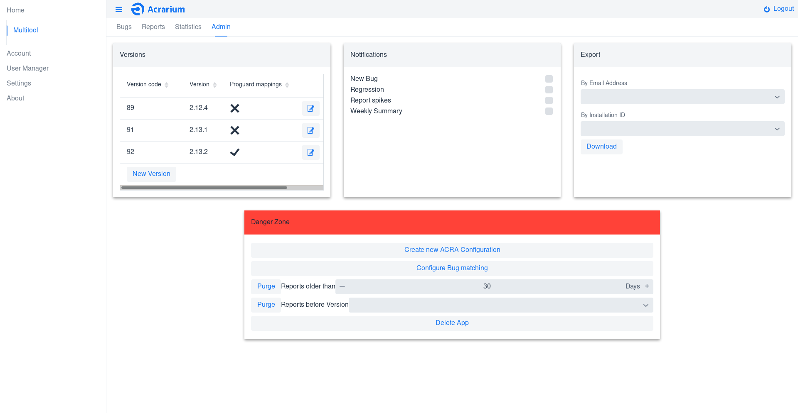
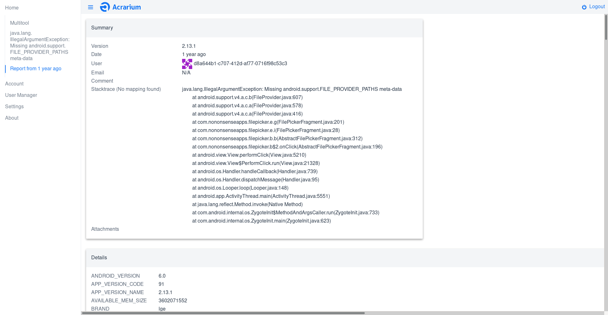
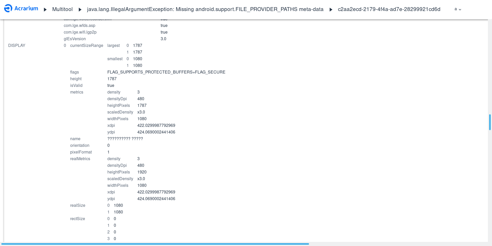
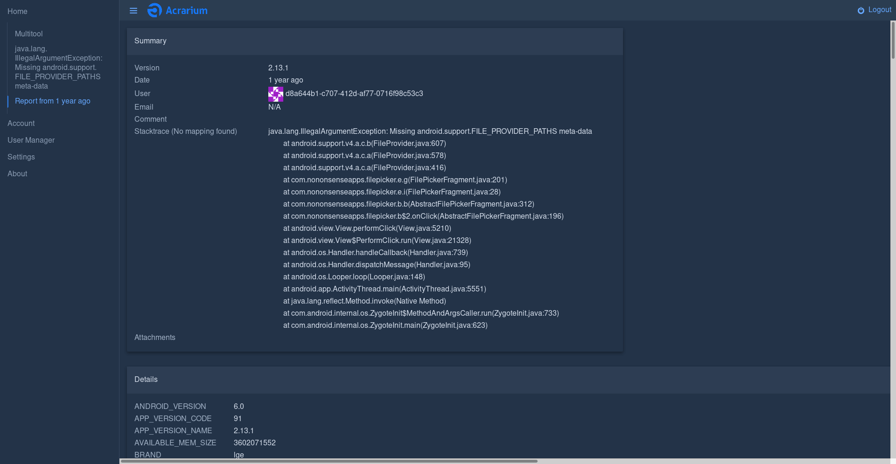

[](https://github.com/F43nd1r/Acrarium/actions)
[](https://github.com/F43nd1r/Acrarium/blob/master/LICENSE)
[](https://hub.docker.com/repository/docker/f43nd1r/acrarium)
[](https://github.com/F43nd1r/Acrarium/releases)
[](https://github.com/F43nd1r/Acrarium/releases)

<h1 align=center>

</h1>

A Backend for [ACRA](https://github.com/ACRA/acra) written in Kotlin using Spring Boot, Vaadin and MySQL

# Setup

See [Wiki Setup guide](https://github.com/F43nd1r/acra-backend/wiki/Setup-guide)

# Screenshots

###### Listing reports



###### Statistics



###### Proguard and Export Support



###### Report Summary and Attachment Support



###### Full Report content



###### Dark Theme



# Development

## Running locally

```shell
./gradlew bootRun
```

## Building release

### Jar

```shell
./gradlew bootJar -x test -Pvaadin.productionMode=true
```

### Docker Image

```shell
./gradlew bootJar -x test -Pvaadin.productionMode=true
docker build -t f43nd1r/acrarium:git acrarium
```

# License

All source code in this repository is licensed under the Apache License 2.0 (see [LICENSE](LICENSE))

# Credits

Thanks to

- [Mirza Zulfan](https://github.com/mirzazulfan) for creating the logo.
- [aptly-io](https://github.com/aptly-io) (Dutch), [Federico Iosue](https://github.com/federicoiosue) (Italian), [Astarivi](https://github.com/astarivi) (
  Spanish), [iisimpler](https://github.com/iisimpler) (Chinese) for contributing to localization.
